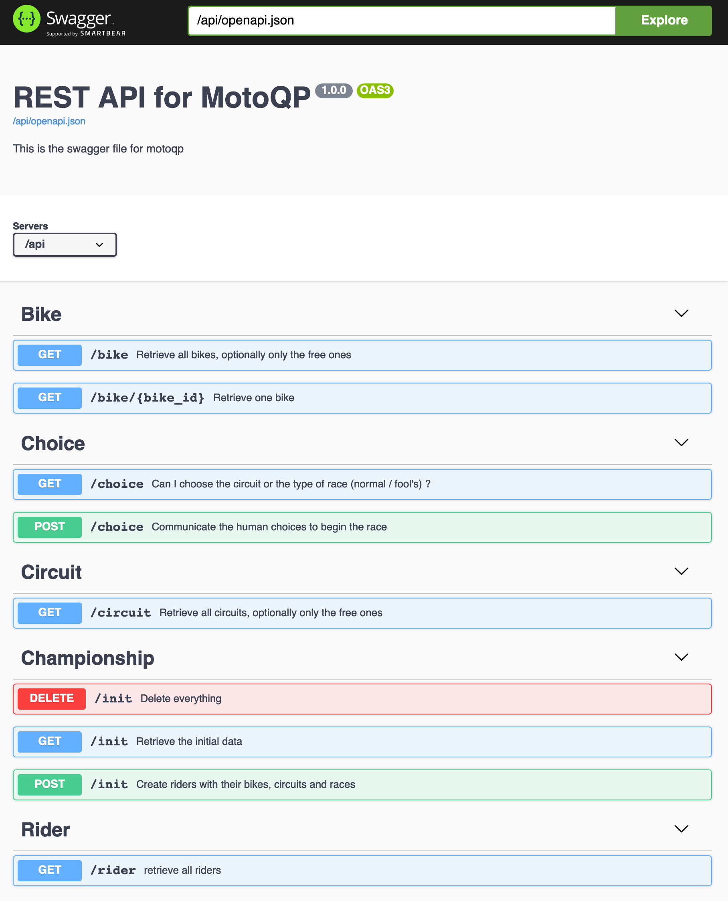
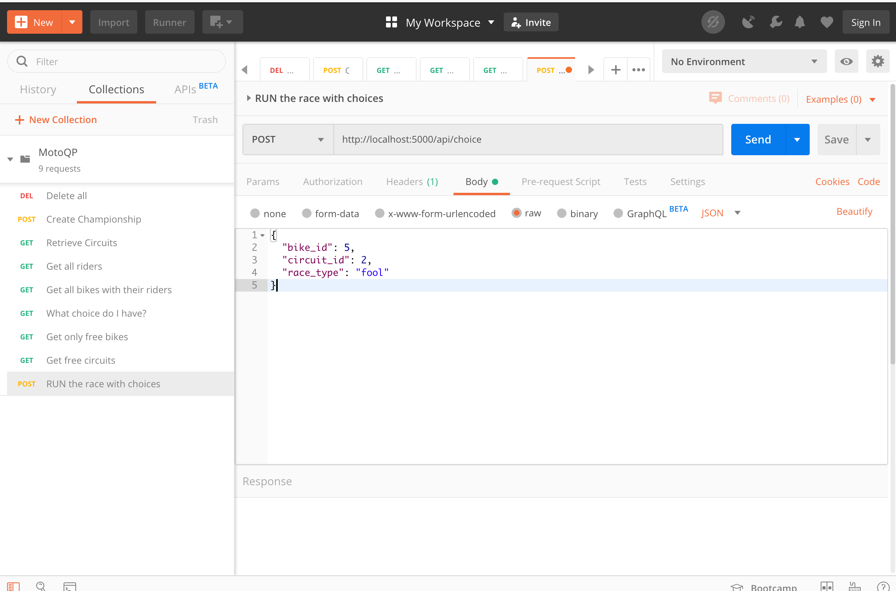
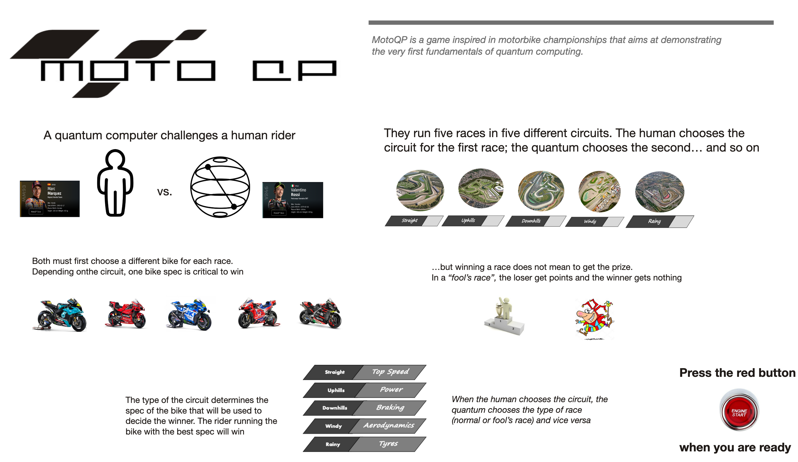

# Moto QP
MotoQP is a game inspired in motorbike championships that aims at demonstrating the very first fundamentals of quantum computing but also hints on advanced ideas. It is inspired on some card games I eagerly played with my mates in the last century

The code is written in [python](https://www.python.org/), uses the embedded web server of [Flask](https://flask.palletsprojects.com/en/1.1.x/) and the REST API functionality of [connexion](https://connexion.readthedocs.io/en/latest/). The quantum computing capabilities are implemented by [Qiskit](https://qiskit.org/).

## The game

The [`README.pdf`](README.pdf) file contains the mechanics of the game. Read it to understand the rules. If you want to see what it looks like, watch this video [SHOWME.mov](SHOWME.mov)

## The quantum stuff

If you are only concerned with the quantum stuff, the file [`qfunctions.py`](qfunctions.py) contain the quantum circuits used in this game. They can be enhanced, customized, improved as you whish. Modify them and see how/if the game changes. If you think they are too simple, the last chart of the [`README.pdf`](README.pdf) contains a more ambitious challenge.

## The programming

If you have no patience to read more, you can skip this section and run a [test](#test)
### Structure

The app consists of four logical components:

1. #### The quantum functions

   Things that could be actually done much better with classical methods but help learn, understand, exercise... and play with the Qiskit functions.

2. #### The fundamentals 
      
   The programming artifacts to manipulate the objects: classes, methods, data structures, etc.

3. #### The game logic
    
    Embedded in API calls so that you can play just invoking the functions of the API. 

4. #### The UI 

   My apologies for not documenting it thoroughly, but going into details would be out of the purpose 

### Code

The code is structured as follows:

- [`app_server.py`](app_server.py) this is the main file as required by Flask, you can simply execute it to run the game
- [`serverqp.py`](serverqp.py) the functions implementing the API calls. [point #3](#the-game-logic) mentioned above
- [`motoqp.py`](motoqp.py) the fundamental classes and methods to handle the bikes, races, riders, etc. The main objects of the game. [point #2](#the-fundamentals) mentioned above.
-  [`qfunctions.py`](qfunctions.py) the quantum computing code. It uses the quantum simulator of Qiskit so that it can run on any computer, not necessarily a real quantum computer. [point #1](#the-quantum-functions) mentioned above.

Other important files are:

- [`swagger.yaml`](swagger.yaml) the definition of the REST API. Simply append the route `/api/ui` to access the specification and try the API calls
- [`Dockerfile`](Dockerfile) if you want to create a [docker](https://www.docker.com) container with the app, this file contains the specification. There is no need to dockerize the app but it can be nice to deploy it in a [Kubernetes](https://kubernetes.io) cluster and run it from anywhere
- [`requirements_server.txt`](requirements_server.txt) the three main python modules to be installed as pre-requisites : ***flask, connexion, qiskit***
- [`docker-compose.yaml`](docker-compose.yaml) to use the utility [docker-compose](https://docs.docker.com/compose/). You know: `docker-compose build` to generate a docker container `docker-compose up` to start the docker container

The [`test`](./test/) directory was used for development and testing. If you want to modify things of the game, you may want to take a look to see the usage patterns. Inside that directory, you'll my find useful the following files:

- [`simple_test.py`](test/simple_test.py) a complete automated test. Just run it to see if everything works
- [`client_test.sh`](test/client_test.sh) analogous, but using the API via [curl](https://curl.se/)
- [`MotoQP.postman_collection.json`](test/MotoQP.postman_collection.json) alternatively, if you want to use [Postman](https://www.postman.com/) to call the API, you can import this file to create a collection with the calls you will need
- [`interactive_test.py`](test/interactive_test.py) if you grew up programming with the [Sinclair ZX Spectrum](https://en.wikipedia.org/wiki/ZX_Spectrum), [Commodore 64](https://en.wikipedia.org/wiki/Commodore_64), [Amstrad CPC](https://en.wikipedia.org/wiki/Amstrad_CPC), etc. you will understand it. Otherwise, you'll wonder why I wasted my time with that and I'll wonder what you will do when you become as old as me ;-) Anyway, I encourage you to use it at least once and read the interactive instructions to understand why and when you need to choose bikes, circuits, etc. It will help you more than trying the API _as is_ 
- ...everything else is not important. Just note the two simbolic links that enables you to run the two programs just mentioned - otherwise, the tests will not find the files referenced as imports

```
         Angel@AngelMac test % ls -l
         -rw-r--r--  1 Angel  wheel   3725 26 mar 16:03 MotoQP.postman_collection.json
         -rwxr-xr-x@ 1 Angel  wheel    387 26 mar 16:08 app.py
         -rwxr-xr-x  1 Angel  wheel   3888 26 mar 14:25 client_test.sh
         -rwxr-xr-x  1 Angel  wheel  12633 29 mar 10:16 interactive_test.py
         lrwxr-xr-x  1 Angel  wheel     12 29 mar 10:14 motoqp.py -> ../motoqp.py
         -rwxr-xr-x@ 1 Angel  wheel    350 24 mar 08:18 myexec.py
         lrwxr-xr-x  1 Angel  wheel     16 29 mar 10:14 qfunctions.py -> ../qfunctions.py
         -rw-r--r--@ 1 Angel  wheel    263 29 mar 10:19 routes.py
         -rwxr-xr-x@ 1 Angel  wheel   4259 29 mar 10:16 simple_test.py
         -rwxr-xr-x  1 Angel  wheel     47 29 mar 10:16 simple_test.sh
    
```

### The User Interface

As mentioned above, the UI details are not the goal of MotoQP. All the code is in the folder [motoqp_client](motoqp_client/) and I recorded a sample game [in YouTube](https://youtu.be/wpzrGbIc5DU) and you can download the video here for a better resolution[SHOWME.mov](SHOWME.mov). If you want to run the client in a separate machine or dockerize the client, it is not only possible, but very easy (see below)


## Setup

1. If you don't have python 3 on your system, install it as you whish. If you like [conda](https://pypi.org/project/conda/), that is OK. I used the standard python 3.9.2 for the development but I am guess that a few versions below will work too.
2. Install the pre-requisites of the server. For example: ` pip3 install -r requirements_server.txt `
3. Start the server app. From the main directory, just type `./app_server.py`
4. Launch a browser and try the address in the last line. Append `/api/ui` to it if you want to see the OpenAPI (Swagger) interface
```
        Angel@AngelMac motoqp % ./app_server.py 
        * Serving Flask app "app_client" (lazy loading)
        * Environment: production
        WARNING: This is a development server. Do not use it in a production deployment.
        Use a production WSGI server instead.
        * Debug mode: off
        * Running on http://0.0.0.0:5000/ (Press CTRL+C to quit)
```

<center></center>

5. Execute [`client_test.sh`](test/client_test.sh) to run a test. The input/output is JSON, not to be read by humans but you can guess for sure if it works well or not. You may want to modify the JSON input to try other values.
6. Alternatively, you may want to use Postman to try the API. Just import the collection contained in [`MotoQP.postman_collection.json `](test/MotoQP.postman_collection.json) 


<center>  </center>

7. If you want to play with the UI, go to the [test](test/) directory and install the pre-requisites. Actually there is only one additional thing to install (the requests module) ` pip3 install -r requirements_client.txt `

8. Now, start the client. Just type `./app_server.py`, launch a browser and enter the address as displayed in the terminal. Note the port (default 5555)


<center>  </center>

9. Finally, follow the instructions of the UI and you can play MotoQP
10. Just one more thing. If the client runs on a separate machine or dockeized, it must know where the server is. You can modify the first lines of the file [app_client.py](motoqp_client/app_client.py) or export the environment variable `  MOTOQPAPI ` to point to the server address (don't forget to add the port and /api). Customize the [Dockerfile](motoqp_client/Dockerfile) and [docker-compose.yaml](motoqp_client/docker-compose.yaml) to match your environment. No surprise if you need to add a docker virtual network and issue a few more commands... well I said the UI is out of scope.

```

   serverurl = os.environ.get('MOTOQPAPI')
   if (serverurl == None) :
      serverurl = 'http://0.0.0.0:5000/api'
      # serverurl = 'http://149.81.109.123:30672/api'


```

## Test

If you really can't wait and want to test it now, just go here [IBM test machine ](http://motoqp.ibm-co-created.com:30109/) but consider that it is a link to a Kubernetes cluster that may have been deleted when you try. So, no guarantee that it is running at the time you click on it. I  re-deploy it from time to time, just for fun. Even if it is running, the code is not designed with multi-session features. That means: if anyone else is messing up at the same time, it will run but the results will be odd. Anyway, enjoy the program and I am looking forward to hearing your comments. Thanks in advance!

